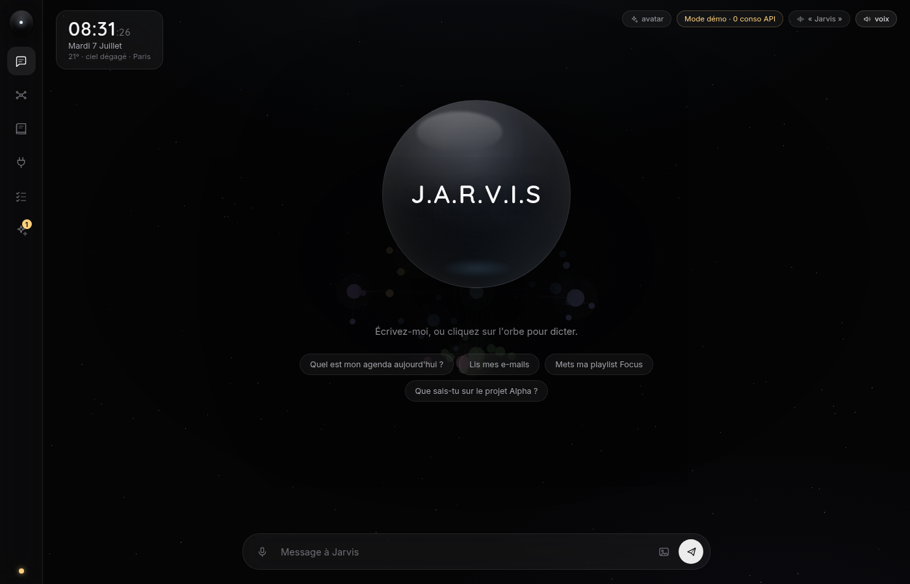

# ◉ JARVIS — assistant IA personnel

Un assistant personnel de nouvelle génération : une **orbe minimaliste** à qui
l'on parle (« Bonjour Jarvis… »), un **cerveau-galaxie 3D** qui mémorise tout,
un **wiki auto-entretenu**, des **connecteurs** vers vos services, et un moteur
agentique Claude qui **agit** — dans une interface noire, épurée, façon Apple.



## ✦ Mode démo intégré (zéro coût)

**Sans clé API, JARVIS est déjà vivant** : au premier démarrage il se remplit
de contenu d'exemple (wiki, notes, tâches, mémoires, e-mails, agenda,
playlists…) et répond localement aux demandes courantes — musique, e-mails,
agenda, notes, tâches, heure, wiki — avec le même flux (streaming, outils,
voix) que le mode réel. Idéal pour tout visualiser avant de configurer une clé.
Badge « Mode démo · 0 conso API » affiché en permanence. Pour réinitialiser le
contenu : supprimez `server/data/jarvis.json`.

## ✦ La voix, façon Siri

- Mot d'activation : dites **« Jarvis »**, **« Hello Jarvis »** ou **« Bonjour
  Jarvis »** (l'écoute continue est active par défaut, désactivable en un clic).
- « Jarvis, mets de la musique » → la commande part immédiatement ; « Jarvis »
  seul → l'orbe passe en écoute et attend votre demande (8 s).
- JARVIS répond à voix haute quand on lui parle à l'oral ; l'orbe s'anime
  (écoute, réflexion, parole).
- **Voix neuronale réelle** : par défaut, JARVIS parle avec une voix neuronale
  Microsoft (fr-FR-HenriNeural — masculine, posée), **gratuite et sans clé**.
  Encore plus naturel : mettez `ELEVENLABS_API_KEY` dans `.env`
  (elevenlabs.io, offre gratuite). Hors-ligne, repli automatique sur la voix
  du navigateur. Réglez la voix avec `JARVIS_VOICE` (voir `.env.example`).

## ✦ Fonctionnalités

| Domaine | Ce qui est livré |
|---|---|
| **Interface minimaliste** | Orbe noire animée (respiration, halo d'écoute, scintillement de réflexion, pulsation de parole), rail de navigation en verre, vues dédiées (Jarvis, Cerveau, Wiki, Connecteurs, Agenda & tâches, Auto-dev), typographies embarquées (Quicksand + Inter), icônes SVG sur mesure. |
| **Connecteurs** | 12 connecteurs avec icônes de marque : Gmail, Google Agenda, Google Drive, Spotify, Notion, Slack, Figma, Adobe, Higgsfield, Runware, Webflow, Chrome. **Branchement guidé depuis l'UI** : jeton à coller (Notion, Slack, Figma, Webflow…) ou OAuth (Google, Spotify) — étapes affichées, test de la clé, statut « Connecté ». Une fois branché, e-mails, agenda, Drive, playlists, canaux Slack et pages Notion sont **réels** ; sinon les données restent simulées. |
| **Cerveau-galaxie 3D** | Graphe de connaissance rendu en WebGL (three.js / react-three-fiber) : hubs de domaines sur une sphère de Fibonacci, nœuds reliés par arcs, rotation douce, halos, champ d'étoiles. Zoom sémantique (les étiquettes apparaissent en s'approchant), survol, clic → vol de caméra + panneau de détail, recherche qui « vole » jusqu'au nœud, fil d'ariane. |
| **Conversation** | Streaming token par token (SSE), markdown riche, personnalité JARVIS (posé, vouvoiement, humour pince-sans-dire). Historique persistant. |
| **Routeur multi-modèle** | JARVIS choisit lui-même son modèle Claude selon la tâche : `claude-haiku-4-5` (rapide) / `claude-sonnet-5` (équilibré) / `claude-opus-4-8` (profond). Surcharge manuelle dans la barre du haut. Le modèle utilisé **et la raison du choix** sont affichés sur chaque réponse. |
| **Outils (function calling)** | Boucle agentique serveur : date/heure, mémoire (`remember`/`recall`), notes, tâches (créer/lister/terminer), recherche dans la connaissance (RAG), recherche web, exécution de JavaScript en bac à sable. Chaque action alimente le cerveau en temps réel. |
| **Mémoire persistante** | Tout ce que JARVIS apprend (faits, notes, tâches, recherches, documents, conversations) devient un nœud du cerveau, relié sémantiquement à ses voisins. Persistance JSON sur disque. |
| **RAG documents** | Indexation de documents texte (`POST /api/documents`) + recherche TF-IDF interrogeable par JARVIS (`search_knowledge`). |
| **LLM Wiki** | D'après le [pattern de Karpathy](https://gist.github.com/karpathy/442a6bf555914893e9891c11519de94f) : JARVIS **rédige et entretient des pages de synthèse** markdown interconnectées (renvois `[[...]]`). *Ingest* automatique à chaque note/mémoire/document (asynchrone, sérialisé), outil `consult_wiki` pour répondre depuis la connaissance déjà compilée, et *lint* (bouton « Auditer la cohérence ») qui traque contradictions, doublons et renvois cassés. Les pages vivent dans le domaine « Wiki » de la galaxie et se lisent en markdown. |
| **Voix** | Mot d'activation « Jarvis » en écoute continue, carillon de réveil, dictée ponctuelle (bouton micro), **voix neuronale** (Edge gratuit / ElevenLabs en option, repli navigateur) avec orbe et avatar animés. |
| **Vision** | Joignez des images au chat : elles sont envoyées à Claude (blocs image base64). |
| **Auto-développement supervisé** | JARVIS peut proposer de **nouveaux outils** (il écrit le code JS via `propose_skill`) ; vous les approuvez ou rejetez dans le panneau *Auto-dev*. Une compétence approuvée devient immédiatement un outil actif, exécuté en bac à sable. Chaque proposition est journalisée dans le cerveau. |
| **Cockpit** | Panneaux vivants : statut (modèle actif, routage), tâches, mémoire, propositions auto-dev, journal d'activité. |

## ✦ Démarrage

Prérequis : **Node.js ≥ 20**.

```bash
git clone <ce dépôt> && cd Jarvis
npm install                      # installe racine + server + client (workspaces)
cp .env.example .env             # puis renseignez ANTHROPIC_API_KEY
npm run dev                      # serveur (3001) + client Vite (5173)
```

Ouvrez **http://localhost:5173** (Chrome ou Edge pour la voix). Sans clé API,
le **mode démo** s'active tout seul : contenu d'exemple + réponses simulées,
coût zéro. Ajoutez la clé quand vous voudrez l'intelligence réelle.

```bash
npm run build   # build production (server/dist + client/dist)
npm start       # serveur de production
```

## ✦ Configuration (`.env`)

| Variable | Rôle | Défaut |
|---|---|---|
| `ANTHROPIC_API_KEY` | Clé API Anthropic (côté serveur uniquement, jamais exposée au front). Absente → mode démo | — |
| `JARVIS_DEMO` | `1` pour forcer le mode démo même avec une clé | — |
| `PORT` | Port du backend | `3001` |
| `JARVIS_MODEL_FAST` | Modèle du tier « rapide » | `claude-haiku-4-5` |
| `JARVIS_MODEL_BALANCED` | Modèle du tier « équilibré » | `claude-sonnet-5` |
| `JARVIS_MODEL_DEEP` | Modèle du tier « profond » | `claude-opus-4-8` |
| `JARVIS_DATA_FILE` | Fichier de persistance | `server/data/jarvis.json` |

## ✦ Architecture

```
Jarvis/
├─ server/                      Node + Express + TypeScript (ESM)
│  └─ src/
│     ├─ ai/
│     │  ├─ router.ts           routeur multi-modèle (heuristiques + override)
│     │  ├─ prompt.ts           personnalité JARVIS (préfixe stable → prompt caching)
│     │  └─ jarvis.ts           boucle agentique en streaming (SSE)
│     ├─ tools/
│     │  ├─ index.ts            registre d'outils (function calling) + outils dynamiques
│     │  └─ sandbox.ts          bac à sable node:vm (code + compétences)
│     ├─ brain/graph.ts         graphe de connaissance (hubs, liens sémantiques, semence)
│     ├─ memory/search.ts       recherche TF-IDF (RAG léger, interface remplaçable)
│     ├─ selfdev/index.ts       propositions de compétences + validation humaine
│     ├─ db/store.ts            persistance JSON (interface minimale → migrable SQLite/pgvector)
│     ├─ routes.ts              API REST + SSE
│     └─ index.ts               bootstrap Express
└─ client/                      React 19 + TypeScript + Vite
   └─ src/
      ├─ components/brain/      cerveau-sphère (Canvas r3f, layout, zoom sémantique, vol caméra)
      ├─ components/chat/       conversation streaming + voix (STT/TTS)
      ├─ components/panels/     cockpit (statut, tâches, mémoire, auto-dev, activité)
      ├─ state.ts               store zustand (chat, graphe, panneaux)
      └─ api.ts                 client SSE + REST
```

**Principes :**
- **Modulaire** : chaque capacité (voix, routeur, outils, mémoire, auto-dev) est un
  module indépendant. Ajouter un outil = un objet `{definition, handler}` dans
  `server/src/tools/index.ts` — rien d'autre à toucher.
- **Sécurité** : la clé API vit côté serveur. Les erreurs API (auth, rate limit,
  réseau) sont interceptées et affichées proprement, jamais de crash.
- **Streaming de bout en bout** : Claude → SSE → UI, y compris les événements
  d'outils et les nœuds de cerveau créés en direct.
- **Prompt caching** : le prompt système est stable et marqué `cache_control`,
  l'historique passe après — les tours suivants lisent le cache.

### Protocole SSE du chat (`POST /api/chat`)

| Événement | Contenu |
|---|---|
| `meta` | `{model, tier, reason}` — décision du routeur |
| `text` | `{delta}` — texte token par token |
| `tool_start` / `tool_result` | activité d'outils en direct |
| `node_added` | nouveau nœud du cerveau (affiché sans recharger) |
| `done` | `{messageId, toolsUsed}` |
| `error` | message d'erreur lisible |

### API principale

```
GET  /api/health                     état + modèles + mode démo
GET  /api/connectors                 connecteurs + statut + marche à suivre
GET  /api/connectors/:id             données d'un connecteur (réelles si branché)
POST /api/connectors/:id/credentials brancher : {token} ou {clientId, clientSecret}
GET  /api/connectors/:id/callback    retour OAuth du fournisseur
POST /api/connectors/:id/disconnect  débrancher (efface la clé)
POST /api/chat                       chat SSE {message, modelOverride?, images?}
GET  /api/brain/graph                nœuds + arêtes du cerveau
GET  /api/brain/search?q=            recherche de nœuds
GET  /api/notes|tasks|memories       collections
POST /api/tasks/:id/toggle           cocher/décocher
POST /api/documents                  indexer un document texte (RAG)
GET  /api/knowledge/search?q=        recherche TF-IDF
GET  /api/wiki                       pages de synthèse (LLM Wiki)
GET  /api/wiki/:slug                 une page complète
POST /api/wiki/lint                  audit de cohérence du wiki
GET  /api/selfdev/proposals          propositions d'auto-dev
POST /api/selfdev/proposals/:id/review  {decision: approved|rejected}
```

## ✦ Connecter vos vrais services

Ouvrez la vue **Connecteurs** et cliquez une carte : la marche à suivre exacte
s'affiche, étape par étape.

- **Jeton à coller** (2 minutes) — Notion, Slack, Figma, Webflow, Runware,
  Higgsfield, Adobe : créez un jeton chez le fournisseur (lien direct fourni),
  collez-le, JARVIS le **teste** puis l'enregistre.
- **OAuth** (5 minutes) — Gmail, Google Agenda, Google Drive, Spotify : créez
  une app gratuite chez le fournisseur, déclarez l'URI de redirection affichée,
  collez le client ID + secret, cliquez **Autoriser**. Les jetons se
  rafraîchissent tout seuls ensuite.

Une fois branché : e-mails, agenda, fichiers Drive, playlists Spotify, canaux
Slack et pages Notion deviennent **réels** — dans les popups, dans le chat
(mode démo comme mode complet), et via les outils de Claude (`check_emails`,
`check_calendar`, `search_drive`, `spotify_status`, `read_slack`,
`search_notion`).

Les clés sont stockées dans `server/data/connectors.json` — **local et ignoré
par git**, jamais exposé au client. « Déconnecter » efface la clé.

## ✦ Étendre JARVIS

**Ajouter un outil (à la main)** — dans `server/src/tools/index.ts` :

```ts
{
  definition: {
    name: "mon_outil",
    description: "Quand et pourquoi l'utiliser.",
    input_schema: { type: "object", properties: { x: { type: "string" } }, required: ["x"] },
  },
  handler: async (input) => ({ result: `Fait : ${input.x}` }),
}
```

**Laisser JARVIS s'étendre lui-même** — demandez-lui en conversation :
*« Propose-toi une compétence pour convertir des températures »* → il appelle
`propose_skill`, la proposition apparaît dans le panneau **Auto-dev** avec le
code visible → vous approuvez → l'outil est actif au tour suivant. Réversible
(le code tourne en bac à sable `node:vm`, sans réseau ni fichiers).

> ⚠️ `node:vm` est un garde-fou, pas une frontière de sécurité absolue :
> l'auto-dev est conçu pour un usage personnel local et **supervisé**.

**Remplacer la persistance** — `server/src/db/store.ts` expose `getDb()/save()`.
Brancher SQLite/Postgres + un store vectoriel (pour remplacer le TF-IDF de
`memory/search.ts` par de vrais embeddings) ne touche ni les outils ni l'UI.

## ✦ Feuille de route suggérée

- [ ] Embeddings réels (store vectoriel) pour `recall`/`search_knowledge`
- [ ] Recherche web de qualité via l'outil serveur `web_search` d'Anthropic
- [ ] Génération d'images (interface prévue : un provider = un module d'outil)
- [ ] Post-processing bloom sur la sphère + mini-carte
- [ ] Upload de PDF (parsing côté serveur → indexation RAG)
- [ ] Multi-conversations + résumé/compaction de l'historique
